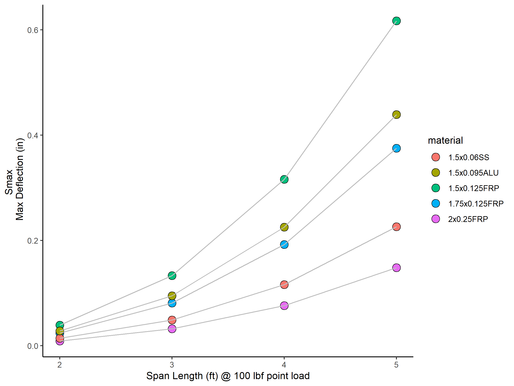

## Overview

A comparison of commonly available structural tubes for use in marine applications.

The table shows:

* moment of inertia (in^4^)
* modulus of elasticity (PSI)
* deflection of a 100 lb centered point load at 6, 5, 4, 3, & 2 feet of span
* material cost ($/ft)
* material density (lbs/in^3^)
* material weight (lbs/ft)

For each of 5 tubes of various materials and sizes:

* FRP (fiberglass-reinforced polyester)
  + 1.5" x 0.125" wall thickness
  + 1.75" x 0.125" wall thickness
  + 2" x 0.25" wall thickness
* 316 Stainless steel
  + 1.5" x 0.065" wall thickness
* 6061 T6 Aluminum
  + 1.5" x 0.095" wall thickness


The figure shows the same data and is interactive. Hover over any point for more information. 


|material      |    Ix|        E| S_100lb_6ft| S_100lb_5ft| S_100lb_4ft| S_100lb_3ft| S_100lb_2ft| price_ft| area_in| dens_lbs_in3| weight_ft|
|:-------------|-----:|--------:|-----------:|-----------:|-----------:|-----------:|-----------:|--------:|-------:|------------:|---------:|
|1.5x0.125FRP  | 0.129|  5655000|       1.066|       0.617|       0.316|       0.133|       0.039|     7.50|   0.540|        0.064|     0.415|
|1.75x0.125FRP | 0.212|  5655000|       0.649|       0.375|       0.192|       0.081|       0.024|     8.20|   0.638|        0.064|     0.490|
|2x0.25FRP     | 0.537|  5655000|       0.256|       0.148|       0.076|       0.032|       0.009|    15.80|   1.374|        0.640|    10.552|
|1.5x0.06SS    | 0.071| 27985000|       0.391|       0.226|       0.116|       0.049|       0.014|    16.00|   0.293|        0.289|     1.016|
|1.5x0.095ALU  | 0.104|  9860000|       0.758|       0.439|       0.225|       0.095|       0.028|    31.75|   0.419|        0.098|     0.490|


```{=html}
<div class="plotly html-widget html-fill-item-overflow-hidden html-fill-item" id="htmlwidget-0fbfec7b9799b1b42f0b" style="width:2400px;height:1800px;"></div>
<script type="application/json" data-for="htmlwidget-0fbfec7b9799b1b42f0b">{"x":{"data":[{"x":[5,4,3,2],"y":[0.226,0.116,0.049,0.014],"text":"<br />Weight/ft:  1.02 lbs<br />Price/ft: $ 16","type":"scatter","mode":"markers","marker":{"autocolorscale":false,"color":"rgba(248,118,109,1)","opacity":1,"size":15.1181102362205,"symbol":"circle","line":{"width":1.88976377952756,"color":"rgba(0,0,0,1)"}},"hoveron":"points","name":"1.5x0.06SS","legendgroup":"1.5x0.06SS","showlegend":true,"xaxis":"x","yaxis":"y","hoverinfo":"text","frame":null},{"x":[5,4,3,2],"y":[0.439,0.225,0.095,0.028],"text":"<br />Weight/ft:  0.49 lbs<br />Price/ft: $ 31.75","type":"scatter","mode":"markers","marker":{"autocolorscale":false,"color":"rgba(163,165,0,1)","opacity":1,"size":15.1181102362205,"symbol":"circle","line":{"width":1.88976377952756,"color":"rgba(0,0,0,1)"}},"hoveron":"points","name":"1.5x0.095ALU","legendgroup":"1.5x0.095ALU","showlegend":true,"xaxis":"x","yaxis":"y","hoverinfo":"text","frame":null},{"x":[5,4,3,2],"y":[0.617,0.316,0.133,0.039],"text":"<br />Weight/ft:  0.41 lbs<br />Price/ft: $ 7.5","type":"scatter","mode":"markers","marker":{"autocolorscale":false,"color":"rgba(0,191,125,1)","opacity":1,"size":15.1181102362205,"symbol":"circle","line":{"width":1.88976377952756,"color":"rgba(0,0,0,1)"}},"hoveron":"points","name":"1.5x0.125FRP","legendgroup":"1.5x0.125FRP","showlegend":true,"xaxis":"x","yaxis":"y","hoverinfo":"text","frame":null},{"x":[5,4,3,2],"y":[0.375,0.192,0.081,0.024],"text":"<br />Weight/ft:  0.49 lbs<br />Price/ft: $ 8.2","type":"scatter","mode":"markers","marker":{"autocolorscale":false,"color":"rgba(0,176,246,1)","opacity":1,"size":15.1181102362205,"symbol":"circle","line":{"width":1.88976377952756,"color":"rgba(0,0,0,1)"}},"hoveron":"points","name":"1.75x0.125FRP","legendgroup":"1.75x0.125FRP","showlegend":true,"xaxis":"x","yaxis":"y","hoverinfo":"text","frame":null},{"x":[5,4,3,2],"y":[0.148,0.076,0.032,0.009],"text":"<br />Weight/ft:  10.55 lbs<br />Price/ft: $ 15.8","type":"scatter","mode":"markers","marker":{"autocolorscale":false,"color":"rgba(231,107,243,1)","opacity":1,"size":15.1181102362205,"symbol":"circle","line":{"width":1.88976377952756,"color":"rgba(0,0,0,1)"}},"hoveron":"points","name":"2x0.25FRP","legendgroup":"2x0.25FRP","showlegend":true,"xaxis":"x","yaxis":"y","hoverinfo":"text","frame":null},{"x":[2,3,4,5],"y":[0.014,0.049,0.116,0.226],"text":"<br />Weight/ft:  1.02 lbs<br />Price/ft: $ 16","type":"scatter","mode":"lines","line":{"width":1.88976377952756,"color":"rgba(190,190,190,1)","dash":"solid"},"hoveron":"points","name":"1.5x0.06SS","legendgroup":"1.5x0.06SS","showlegend":false,"xaxis":"x","yaxis":"y","hoverinfo":"text","frame":null},{"x":[2,3,4,5],"y":[0.028,0.095,0.225,0.439],"text":"<br />Weight/ft:  0.49 lbs<br />Price/ft: $ 31.75","type":"scatter","mode":"lines","line":{"width":1.88976377952756,"color":"rgba(190,190,190,1)","dash":"solid"},"hoveron":"points","name":"1.5x0.095ALU","legendgroup":"1.5x0.095ALU","showlegend":false,"xaxis":"x","yaxis":"y","hoverinfo":"text","frame":null},{"x":[2,3,4,5],"y":[0.039,0.133,0.316,0.617],"text":"<br />Weight/ft:  0.41 lbs<br />Price/ft: $ 7.5","type":"scatter","mode":"lines","line":{"width":1.88976377952756,"color":"rgba(190,190,190,1)","dash":"solid"},"hoveron":"points","name":"1.5x0.125FRP","legendgroup":"1.5x0.125FRP","showlegend":false,"xaxis":"x","yaxis":"y","hoverinfo":"text","frame":null},{"x":[2,3,4,5],"y":[0.024,0.081,0.192,0.375],"text":"<br />Weight/ft:  0.49 lbs<br />Price/ft: $ 8.2","type":"scatter","mode":"lines","line":{"width":1.88976377952756,"color":"rgba(190,190,190,1)","dash":"solid"},"hoveron":"points","name":"1.75x0.125FRP","legendgroup":"1.75x0.125FRP","showlegend":false,"xaxis":"x","yaxis":"y","hoverinfo":"text","frame":null},{"x":[2,3,4,5],"y":[0.009,0.032,0.076,0.148],"text":"<br />Weight/ft:  10.55 lbs<br />Price/ft: $ 15.8","type":"scatter","mode":"lines","line":{"width":1.88976377952756,"color":"rgba(190,190,190,1)","dash":"solid"},"hoveron":"points","name":"2x0.25FRP","legendgroup":"2x0.25FRP","showlegend":false,"xaxis":"x","yaxis":"y","hoverinfo":"text","frame":null}],"layout":{"margin":{"t":25.7412480974125,"r":7.30593607305936,"b":39.6955859969559,"l":43.1050228310502},"plot_bgcolor":"rgba(255,255,255,1)","paper_bgcolor":"rgba(255,255,255,1)","font":{"color":"rgba(0,0,0,1)","family":"","size":14.6118721461187},"xaxis":{"domain":[0,1],"automargin":true,"type":"linear","autorange":false,"range":[1.85,5.15],"tickmode":"array","ticktext":["2","3","4","5"],"tickvals":[2,3,4,5],"categoryorder":"array","categoryarray":["2","3","4","5"],"nticks":null,"ticks":"outside","tickcolor":"rgba(51,51,51,1)","ticklen":3.65296803652968,"tickwidth":0.66417600664176,"showticklabels":true,"tickfont":{"color":"rgba(77,77,77,1)","family":"","size":11.689497716895},"tickangle":-0,"showline":true,"linecolor":"rgba(0,0,0,1)","linewidth":0.66417600664176,"showgrid":false,"gridcolor":null,"gridwidth":0,"zeroline":false,"anchor":"y","title":{"text":"Span Length (ft) @ 100 lbf point load","font":{"color":"rgba(0,0,0,1)","family":"","size":14.6118721461187}},"hoverformat":".2f"},"yaxis":{"domain":[0,1],"automargin":true,"type":"linear","autorange":false,"range":[-0.0214,0.6474],"tickmode":"array","ticktext":["0.0","0.2","0.4","0.6"],"tickvals":[0,0.2,0.4,0.6],"categoryorder":"array","categoryarray":["0.0","0.2","0.4","0.6"],"nticks":null,"ticks":"outside","tickcolor":"rgba(51,51,51,1)","ticklen":3.65296803652968,"tickwidth":0.66417600664176,"showticklabels":true,"tickfont":{"color":"rgba(77,77,77,1)","family":"","size":11.689497716895},"tickangle":-0,"showline":true,"linecolor":"rgba(0,0,0,1)","linewidth":0.66417600664176,"showgrid":false,"gridcolor":null,"gridwidth":0,"zeroline":false,"anchor":"x","title":{"text":"Smax <br /> Max Deflection (in)","font":{"color":"rgba(0,0,0,1)","family":"","size":14.6118721461187}},"hoverformat":".2f"},"shapes":[{"type":"rect","fillcolor":null,"line":{"color":null,"width":0,"linetype":[]},"yref":"paper","xref":"paper","x0":0,"x1":1,"y0":0,"y1":1}],"showlegend":true,"legend":{"bgcolor":"rgba(255,255,255,1)","bordercolor":"transparent","borderwidth":1.88976377952756,"font":{"color":"rgba(0,0,0,1)","family":"","size":11.689497716895},"title":{"text":"material","font":{"color":"rgba(0,0,0,1)","family":"","size":14.6118721461187}}},"hovermode":"closest","barmode":"relative"},"config":{"doubleClick":"reset","modeBarButtonsToAdd":["hoverclosest","hovercompare"],"showSendToCloud":false},"source":"A","attrs":{"3ec420351594":{"x":{},"y":{},"fill":{},"text":{},"type":"scatter"},"3ec43ab54e2a":{"x":{},"y":{},"fill":{},"text":{}}},"cur_data":"3ec43ab54e2a","visdat":{"3ec420351594":["function (y) ","x"],"3ec43ab54e2a":["function (y) ","x"]},"highlight":{"on":"plotly_click","persistent":false,"dynamic":false,"selectize":false,"opacityDim":0.2,"selected":{"opacity":1},"debounce":0},"shinyEvents":["plotly_hover","plotly_click","plotly_selected","plotly_relayout","plotly_brushed","plotly_brushing","plotly_clickannotation","plotly_doubleclick","plotly_deselect","plotly_afterplot","plotly_sunburstclick"],"base_url":"https://plot.ly"},"evals":[],"jsHooks":[]}</script>
```


<!-- -->

## Session Information


```
R version 4.2.3 (2023-03-15 ucrt)
Platform: x86_64-w64-mingw32/x64 (64-bit)
Running under: Windows 10 x64 (build 19045)

Matrix products: default

locale:
[1] LC_COLLATE=English_United States.utf8 
[2] LC_CTYPE=English_United States.utf8   
[3] LC_MONETARY=English_United States.utf8
[4] LC_NUMERIC=C                          
[5] LC_TIME=English_United States.utf8    

attached base packages:
[1] stats     graphics  grDevices utils     datasets  methods   base     

other attached packages:
 [1] knitr_1.42      plotly_4.10.2   cowplot_1.1.1   lubridate_1.9.2
 [5] forcats_1.0.0   stringr_1.5.0   dplyr_1.1.1     purrr_1.0.1    
 [9] readr_2.1.4     tidyr_1.3.0     tibble_3.2.1    ggplot2_3.4.1  
[13] tidyverse_2.0.0

loaded via a namespace (and not attached):
 [1] tidyselect_1.2.0  xfun_0.38         bslib_0.4.2       colorspace_2.1-0 
 [5] vctrs_0.6.1       generics_0.1.3    htmltools_0.5.5   viridisLite_0.4.1
 [9] yaml_2.3.7        utf8_1.2.3        rlang_1.1.0       jquerylib_0.1.4  
[13] pillar_1.9.0      glue_1.6.2        withr_2.5.0       lifecycle_1.0.3  
[17] munsell_0.5.0     gtable_0.3.3      htmlwidgets_1.6.2 codetools_0.2-19 
[21] evaluate_0.20     labeling_0.4.2    tzdb_0.3.0        fastmap_1.1.1    
[25] crosstalk_1.2.0   fansi_1.0.4       scales_1.2.1      cachem_1.0.7     
[29] jsonlite_1.8.4    farver_2.1.1      hms_1.1.3         digest_0.6.31    
[33] stringi_1.7.12    grid_4.2.3        rprojroot_2.0.3   cli_3.6.1        
[37] tools_4.2.3       magrittr_2.0.3    sass_0.4.5        lazyeval_0.2.2   
[41] pkgconfig_2.0.3   ellipsis_0.3.2    data.table_1.14.8 timechange_0.2.0 
[45] rmarkdown_2.21    httr_1.4.5        rstudioapi_0.14   R6_2.5.1         
[49] compiler_4.2.3   
```


